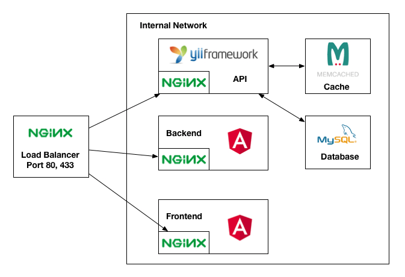
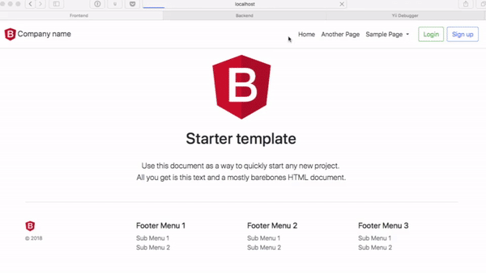
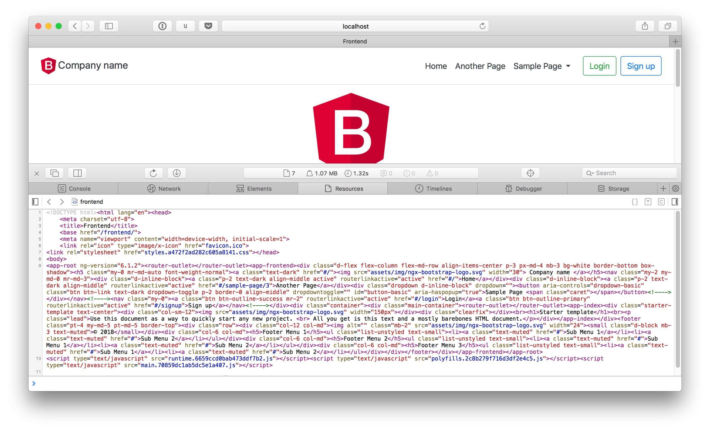

# Yii2 REST API + Angular 6 Boilerplate

This is a boilerplate project for future use. The project consists of REST API developed by Yii2 and backend/frontend developed by Angular 6 with Bootstrap 4. Frontend project is compatible to provide server-side rendering(Angular Universal) using [@ng-toolkit/universal](https://github.com/maciejtreder/ng-toolkit).

The project involves:
* API
    - Yii2 REST API, Yii2 RBAC, JWT (JSON Web Token), Memcached
* Backend: Staff/Administrator dashboard to manage staffs, users and settings
    - Angular 6, Bootstrap 4, JWT (JSON Web Token), Moment.js, Sweet Alert, Underscore.js
* Frontend: User website to support user registration, login and account management 
    - Angular 6, [@ng-toolkit/universal](https://github.com/maciejtreder/ng-toolkit), Bootstrap 4, JWT (JSON Web Token), Moment.js, Sweet Alert

**Architecture Diagram**



**Demo**



**Frontend - Server-side rendering (Angular Universal)**



## Features
- API
    * User Controller
        - GET/POST/PUT/DELETE /v1/user
        - POST /v1/user/login
        - POST /v1/user/signup
        - POST /v1/user/confirm
        - POST /v1/user/password-reset-request
        - POST /v1/user/password-reset-token-verification
        - POST /v1/user/password-reset
        - GET/POST /v1/me
        - GET /v1/page/sse
    * Staff Controller
        - GET/POST/PUT/DELETE /v1/staff
        - POST /v1/staff/login
        - GET /v1/staff/get-permissions
    * Setting Controller
        - GET/POST/PUT/DELETE /v1/setting
        - GET /v1/setting/public
- Backend
    * Staff Login/Logout
        - API generates JWT(JSON Web Token) upon successful login.
    * Dashboard
        - Currently, dashboard is empty page.
    * Staff Management
        - Admin or staff who has a permission 'manageStaffs' can create/update/delete staff information.
        - Staff role can configure permissions for managing staff, user and setting.
    * User Management
        - Admin or staff who has a permission 'manageUsers' can create/update/delete user information.
    * Setting Management
        - Admin or staff who has a permission 'manageSettings' can create/update/delete setting information.
- Frontend
    * Support Angular Universal/server-side rendering
    * User Login/Logout     
        - User can login with username and password.
        - API generates JWT(JSON Web Token) upon successful login.
        - Frontend will store JWT in local storage and use for all requests.
        - API will validate submitted access token prior to process any request. 
    * User Registration
        - User can register new account.
        - API will submit verification email to the email. Note that current API system will use swift mailer component with file transport. You can check the email content in debug module.  
    * User Email Confirmation 
        - Frontend will confirm the auth key and update account status if auth key is valid.
    * User Reset Password
        - User can reset their password.
        - API will send password reset email to the requested email.
        - Frontend will display the password reset page if password reset token is valid.
    * User Account 
        - User can change email address. If change email address, the API will send confirmation email to verify email address.
        - User can change password.

## How to start
Currently, the project is not ready for production use. Following steps are suitable for configuring development environment.

To run the application, you will need `docker` and `docker-compose` installed. 

Open the console and execute following commands.

```
$ git clone https://github.com/chrisleekr/yii2-ngx-boilerplate.git
$ cd yii2-ngx-boilerplate 
$ cp .env-dist .env
$ docker-compose up -d
```

With `docker-compose`, following containers will be configured. Please make sure port 80, 443 are available.

1. MySQL database will be configured.
2. Memcached will be configured.
3. REST API - Yii 2  
   - Database migration will be executed which are located in `/api/migrations`.
   - PHP-FPM and nginx will be running.
4. Backend - Angular
    - By default, development mode will be running with nginx.
5. Frontend - Angular
    - By default, development mode will be running with nginx.
    
Once all containers are finished compiling, then open the browser.

* **REST API - Yii 2**: [http://localhost/api/debug](http://localhost/api/debug)
    - To make sure API is working, go to [http://localhost/api/ping](http://localhost/api/ping). You must see `pong` message.
    - To access docker container, use following command:
        ```
        $ docker exec -it api /bin/sh
        ```
* **Backend - Angular**: [http://localhost/backend](http://localhost/backend)
    - Administrator username: `admin`, password: `123456`
    - Staff username: `staff`, password: `123456`
    - To see compile process, use following command:
        ```
        $ docker logs backend --follow
        ```
    - To access docker container, use following command:
        ```
        $ docker exec -it backend /bin/sh
        ```
    - Note that the **live reloading feature has been disabled** due to restriction. 
    - Please open **Developer Tool** to prevent caching. The changes will be checked every 1s. Please refer `/backend/image-files/usr/local/bin/docker-entrypoint-dev.sh`. 
* **Frontend - Angular**: [http://localhost/frontend](http://localhost/frontend)
    - Username: `user`, password `123456`
    - To see compile process, use following command:
        ```
        $ docker logs frontend --follow
        ```
    - To access docker container, use following command:
        ```
        $ docker exec -it frontend /bin/sh
        ```
    - Note that the **live reloading feature has been disabled** due to restriction. 
    - Please open **Developer Tool** to prevent caching. The changes will be checked every 1s. Please refer `/frontend/image-files/usr/local/bin/docker-entrypoint-dev.sh`.

## Files & Folders structures

- **.env**: contains environment settings
- **docker-compose.yml**: contains docker container specifications
- **api**: Yii2 
    - `image-files`: contains nginx config, php.ini, composer and `docker-entrypoint.sh`
- **backend**: Angular Backend
    - `image-files`: contains nginx config, `docker-entrypoint-dev.sh` and `docker-entrypoint.sh`
- **frontend**: Angular Frontend
    - `image-files`: contains nginx config, `docker-entrypoint-dev.sh` and `docker-entrypoint.sh`
- **nginx**: Load Balancer
    - `image-files`: contains nginx config

## Setup for production

1. Backend
    - To run production mode, update `docker-compose.yml` by changing `dockerfile: ./Dockerfile.dev` to `dockerfile: ./Dockerfile`.
2. Frontend
    - To run production mode, update `docker-compose.yml` by changing `dockerfile: ./Dockerfile.dev` to `dockerfile: ./Dockerfile`.
    - Note that production Dockerfile will use [@ng-toolkit/universal](https://github.com/maciejtreder/ng-toolkit) to provide server side rendering, which means you will be able to provide compiled HTML for search engine.


## Troubleshootings

**I changed backend/frontend code, but I cannot see changes in the browser.**

As mentioned earlier, you have to open `Developer Tool` to prevent cache if you are using Chrome. Or clear browser cache and reload again.

## TODO
- [X] Enhance user management - send confirmation email 
- [X] Enhance user authorization with Yii2 RBAC (Role Based Access Control)
- [X] Develop new customer management section
- [X] Apply JWT(JSON Web Token) for user authentication
- [X] Upgrade Angular 4 to Angular 6
- [X] Dockerize application
- [X] Apply [server side rendering](https://github.com/maciejtreder/ng-toolkit) for Frontend project
- [ ] Develop file uploader
- [ ] Develop more test code 

